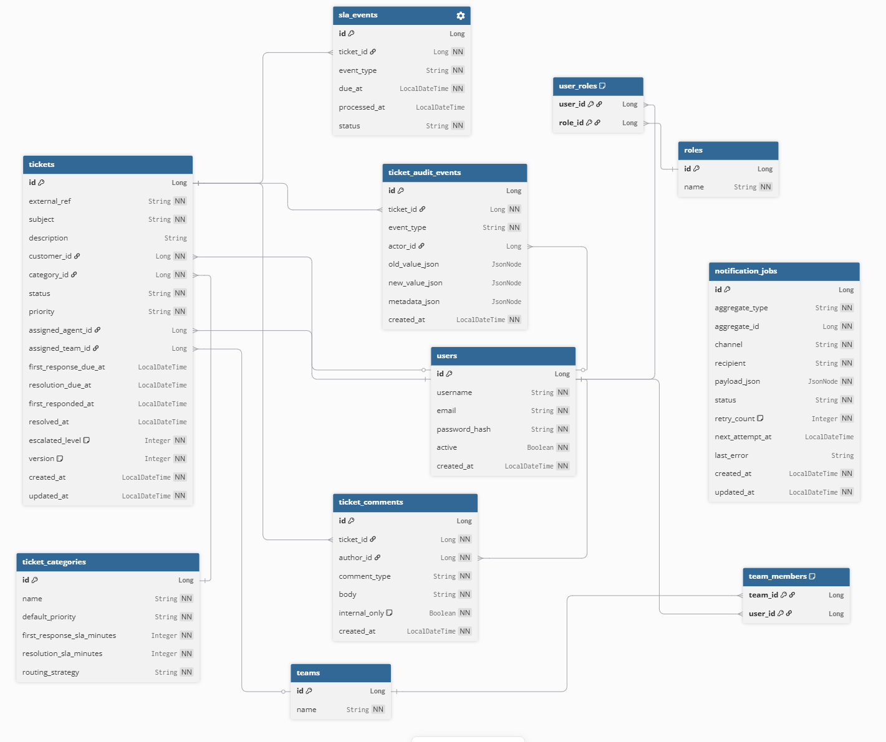

# Ticket Management System

### project overview
A ticket management system for customer support. An end user will raise a ticket which will be resolved by a support team.

### concurrency scenarios
- A user escalate a ticket at the same time an agent has resolved it.
- Two users are locking different tickets then each user is trying to move to the ticket locked by the other user causing a deadlock.
- A background job checks a field in the ticket data to take action (like sending a notification) but between checking the field and doing the action, the data is changed, resulting a faulty action.

